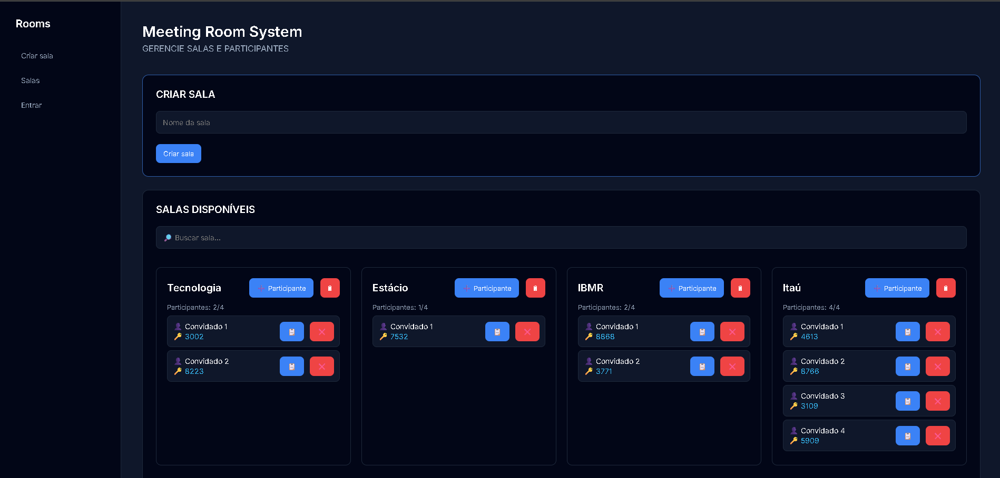

## 📌 MeetingRoomSystem

O **MeetingRoomSystem** é um sistema web completo para gerenciamento de salas de reunião, com controle de participantes por códigos de acesso únicos. Ele permite criar, listar e deletar salas, adicionar participantes, gerar códigos únicos e controlar o acesso de forma prática.

Ideal para equipes pequenas, eventos ou reuniões rápidas.

## 👨‍💻 Funcionalidades:

### Gestão de Salas
- Criar salas com **nomes únicos**.
- Listar todas as salas disponíveis em **cards**.
- Deletar salas junto com todos os participantes vinculados.

### Gestão de Participantes
- Adicionar participante com **apelido opcional**.
- Cada sala suporta **até 4 participantes**.
- Evita **apelidos duplicados** dentro de cada sala.
- Remover participante individualmente.
- Copiar código do participante com um clique.

### Acesso à Sala
- Entrar em uma sala usando o **nome da sala** e **código do participante**.
- Feedback visual de sucesso ou erro caso o código ou sala não existam.

## 🛠️ Tecnologias Utilizadas

**Backend**
- Node.js
- Express.js
- SQLite3

**Frontend**
- HTML5 / CSS3 / JavaScript

