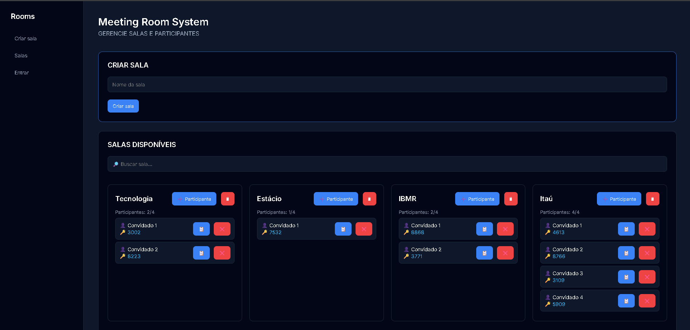

<div align="center">
  

  # 🏢 Meeting Room System
  
  **Um ecossistema moderno e intuitivo para o gerenciamento inteligente de salas de reunião.**

  [](https://nodejs.org/)
  [](https://expressjs.com/)
  [](https://www.sqlite.org/)
  [](https://developer.mozilla.org/en-US/docs/Web/JavaScript)
  [](https://developer.mozilla.org/en-US/docs/Web/CSS)

  <p align="center">
    <a href="#-sobre">Sobre</a> •
    <a href="#-funcionalidades">Funcionalidades</a> •
    <a href="#-tecnologias">Tecnologias</a> •
    <a href="#-instalação">Instalação</a> •
    <a href="#-api-endpoints">API</a>
  </p>
</div>

---

## 📖 Sobre

O **Meeting Room System** é uma solução Full-Stack desenvolvida para simplificar a organização de espaços colaborativos. Com foco em segurança e simplicidade, o sistema utiliza códigos de acesso únicos para garantir que apenas participantes autorizados possam acessar informações críticas de uma reunião.

Ideal para coworkings, startups e empresas que buscam uma ferramenta ágil e visualmente agradável para o controle de salas.

---

## ✨ Funcionalidades

### 🏠 Gestão de Salas
- **Dashboard Intuitivo:** Visualização em cards modernos com status em tempo real.
- **Criação Dinâmica:** Adicione salas com nomes personalizados e únicos.
- **Renomeação:** Flexibilidade para editar nomes de salas existentes.
- **Limpeza Total:** Deletar salas remove automaticamente todos os registros vinculados.

### 👥 Gestão de Participantes
- **Controle de Capacidade:** Suporte para até 4 participantes por sala.
- **Códigos Únicos:** Geração automática de PINs de 4 dígitos para cada membro.
- **Identidade Personalizada:** Opção de adicionar apelidos para facilitar a identificação.
- **Gestão de Acessos:** Remova participantes ou copie seus códigos com um único clique.

### 🔒 Segurança e Acesso
- **Validação de Entrada:** Sistema de check-in que valida o nome da sala e o código do participante.
- **Feedback Visual:** Alertas premium para sucessos, erros de validação ou salas lotadas.

---

## 🛠️ Tecnologias

O projeto foi construído utilizando as melhores práticas de desenvolvimento web moderno:

- **Frontend:** HTML5 semântico, CSS3 (Vanilla com foco em UX/UI) e JavaScript assíncrono.
- **Backend:** Node.js com Express para uma API REST robusta.
- **Banco de Dados:** SQLite para persistência de dados leve e eficiente.
- **Comunicação:** Integração via Fetch API com tratamento de erros centralizado.

---

## 🚀 Instalação

Siga os passos abaixo para rodar o projeto localmente:

### Pré-requisitos
- [Node.js](https://nodejs.org/) instalado.
- [NPM](https://www.npmjs.com/) ou [Yarn](https://yarnpkg.com/) instalado.

### Passo 1: Clonar o Repositório
```bash
git clone https://github.com/gui-ribcosta/MeetingRoomSystem.git
cd MeetingRoomSystem
```

### Passo 2: Configurar o Backend
```bash
cd backend
npm install
npm start
```
O servidor estará rodando em `http://localhost:3000`.

### Passo 3: Rodar o Frontend
Basta abrir o arquivo `frontend/index.html` em seu navegador ou utilizar a extensão **Live Server** no VS Code para uma melhor experiência.

---

## 📡 API Endpoints

| Método | Endpoint | Descrição |
| :--- | :--- | :--- |
| `GET` | `/salas` | Lista todas as salas. |
| `POST` | `/salas` | Cria uma nova sala. |
| `PUT` | `/salas/:id` | Renomeia uma sala específica. |
| `DELETE` | `/salas/:id` | Remove uma sala e seus dados. |
| `GET` | `/salas/:id/codigos` | Lista participantes de uma sala. |
| `POST` | `/salas/:id/codigos` | Adiciona participante (Gera código). |
| `POST` | `/entrar` | Valida acesso à sala. |

---

<div align="center">
  <p>Desenvolvido com ❤️ por <strong>Gui Costa</strong></p>
  <a href="https://github.com/gui-ribcosta">
    
  </a>
</div>


